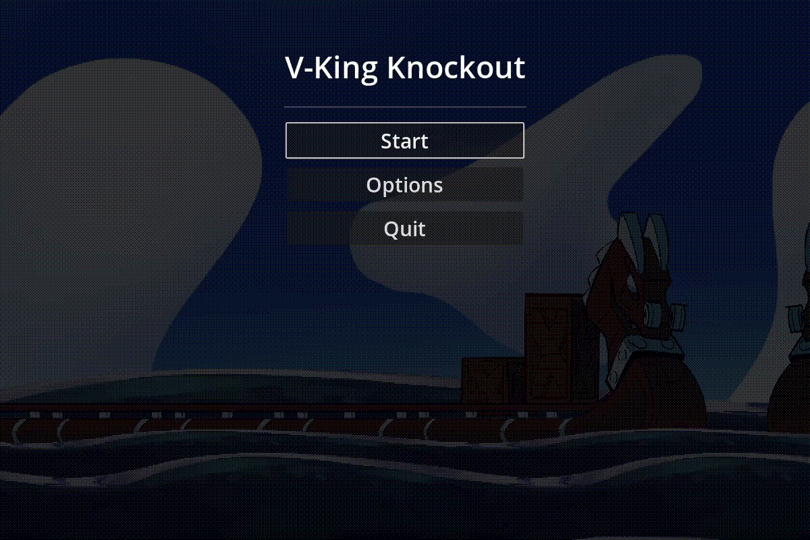
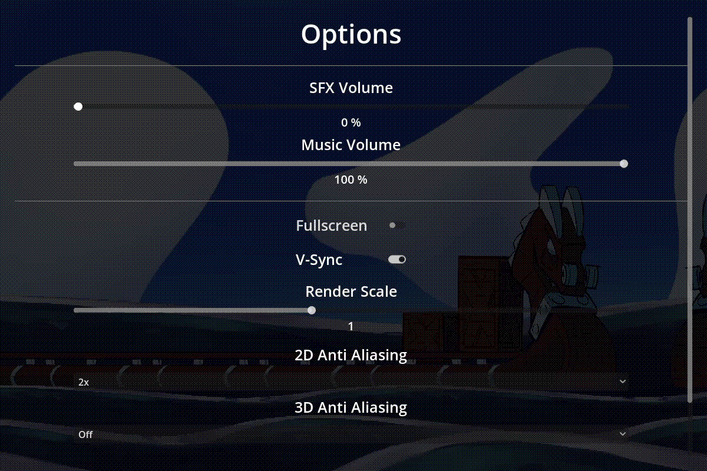
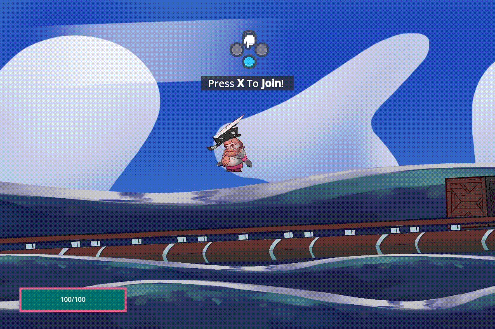

# Godot Menu Template
This plugin adds a basic main, options and pause menu to your project.
# Intended Use
Its intended to be used during gamejams to save some time on menus. Menus are nice to have but most of the time not a priority at gamejames. So here we come to help. You can also use it in a regular project as a temporary menu or just as the full thing. Use it as what ever your heart pleases.
# Features
* Keyboard/Gamepad support
* Autoloading of settings on startup
# Main Menu

Just connect your scene loading logic to the `start_game_pressed` signal of the main menu scene.
# Options Menu

The options menu loads and persists the settings when opened/closed. The data is saved in the `user://options.cfg` file.

The Options menu offers following settings to be changed
* SFX Volume
* Music Volume
* Fullscreen mode
* VSync
* Render Scale for 3D Scenes
* Anti Aliasing 2D
* Anti Aliasing 3D

You open the option menu with the `on_open` method. 

The menu emits a `close` `signal` when closed. With this architecture the parent node decides what to do when the options menu is closed. 
# Pause Menu  

The pause menu is called via the `open_pause_menu` method. It pauses the game and opens the menu. 

The menu emits a `resume signal` when user quits.
You can also hook up to the `back_to_main_pressed signal` to call a method that returns to your games main menu 

# How to use
* Add the `res://addons/MenuTemplates/Nodes/menu_templates_manager.tscn` scene to the autoload of your project.
* For the Audio Sliders to work properly you need to create 2 Audio Busses one called `SFX` and the other called `Music` in your audio bus layout file
